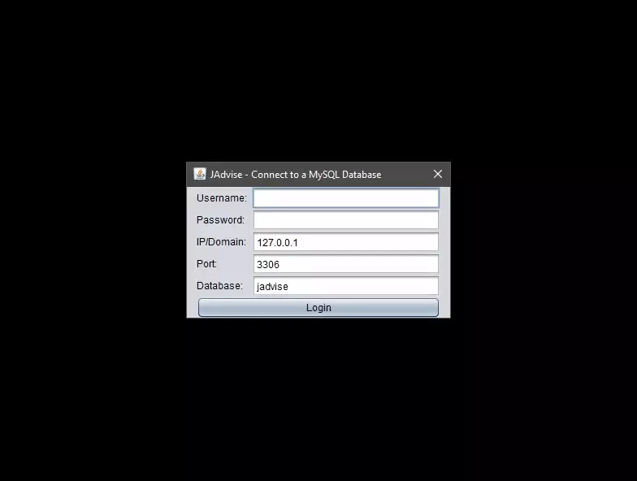

## JAdvise

### About:

This is an assignment I originally created while I was a student at Suffolk County Community College, but I have since taken some time to release a major update to it. This software would allow an adviser or a professor at Suffolk to keep track of student information. For extra credit, I made this program capable of reading and writing to a MySQL database. When I originally submitted this project, it was just below 2 thousand lines of code; now it's over 4 thousand, and it has a lot more features as well. Note that a MySQL server is required to save student data. [XAMPP](https://www.apachefriends.org/download.html) was used for the development of this program, specifically [XAMPP Portable](https://portableapps.com/apps/development/xampp), but WAMP, MAMP, and LAMP should work fine as well.

### Features:

 - Reads and writes student information to a MySQL database.
 - Any detail of a student can be searched for.
   - Regex search is also supported and can be enabled/disabled.
 - Columns can be sorted by any field.
 - Random students can be generated for testing.
   - Students are generated with seeds and can be regenerated with the same seed if desired.
 - Can export all student information to a CSV file.

### Assignment Details:

[Click here to view instructions](https://dapirra.github.io/jadvise/CST242%20Final%20Project.PDF)
